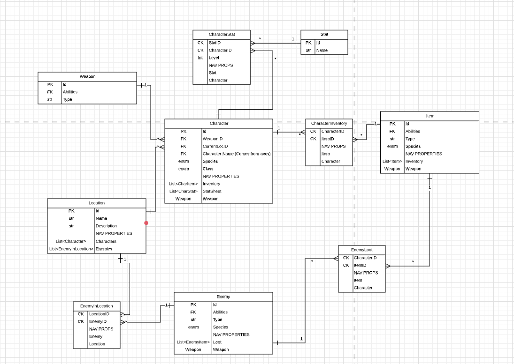
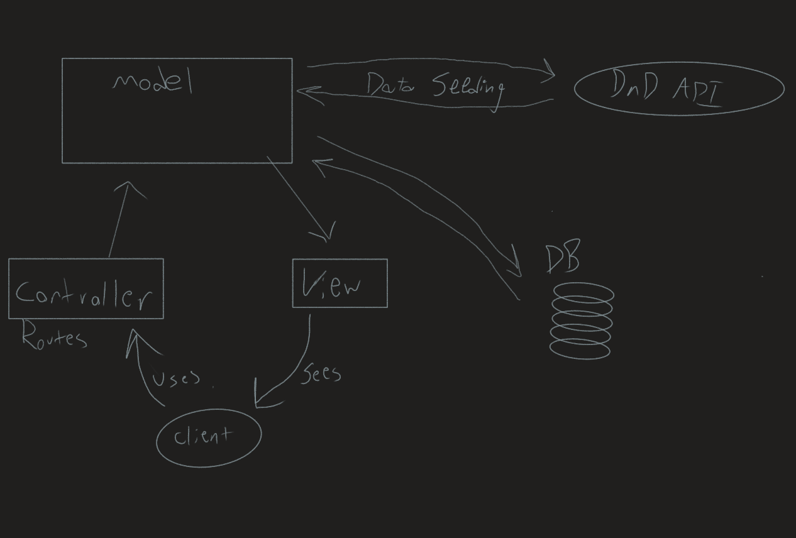

# Crypts And Coders
Authors: *Nicco Ryan, Andrew Smith, Lami Beach*

This API serves as a handy notebook replacement for any tabletop Role-playing games for both players and GameMasters. It contains information about characters, enemies, locations and abilities and will ideally be used to track the progress of a single game, complete with an event log of everything that occurs in the game. Permissions will be set up accordingly so that each individual only has the access to view or modify information they would have in the game itself, GameMasters being omnipotent while players have much more limited access.

[View information and interact with the API](https://table-top-rpg.azurewebsites.net)

[About This API](requirements.md)

[Endpoint Descriptions w/ Examples](endpoints.md)

[Azure Deployment Link](https://table-top-rpg.azurewebsites.net/)

[Requirements & Routes](requirements.md)

[Swagger](https://table-top-rpg.azurewebsites.net/swagger)

[Azure Boards](https://dev.azure.com/CryptsAndCoders/CryptsAndCoders)

---

## Visuals

### Database ERD

[ERD Explanations](https://docs.google.com/document/d/18l6eFtC1B1aWomSokPo2aEY6dHkXdq_5J7Jy7JMoAOw/edit?usp=sharing)

---

### Domain Model

---

### Change Log

- 1.3 Authorization & authentication added - 04 Aug 2020
- 1.2 DTOs configured - 04 Aug 2020
- 1.1 Unit tests for all controllers - 04 Aug 2020
- 1.0 Services, models and controllers setup - 03 Aug 2020

